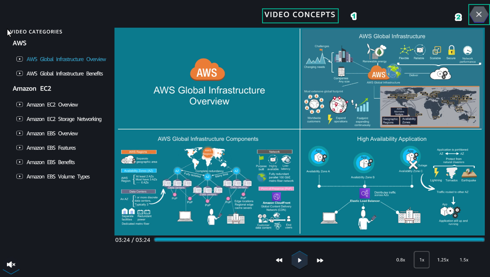
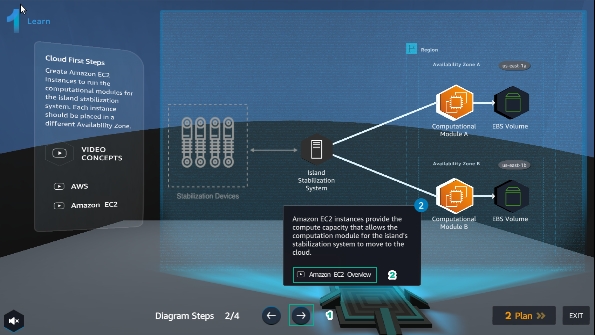
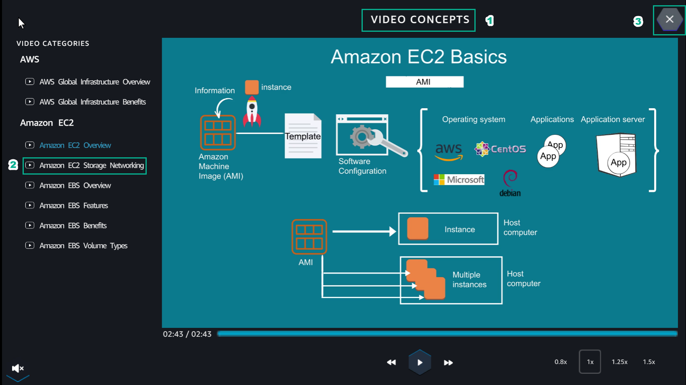
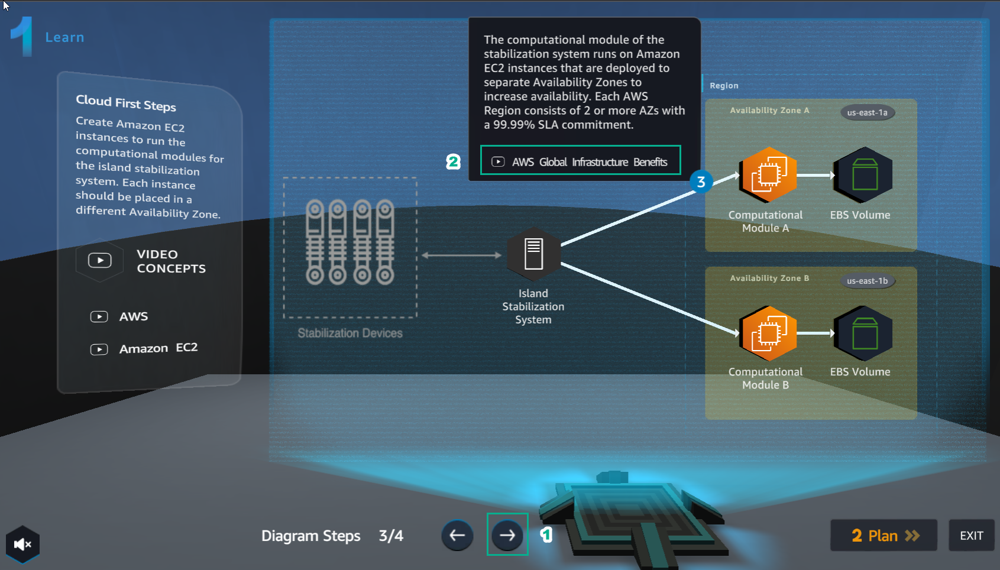
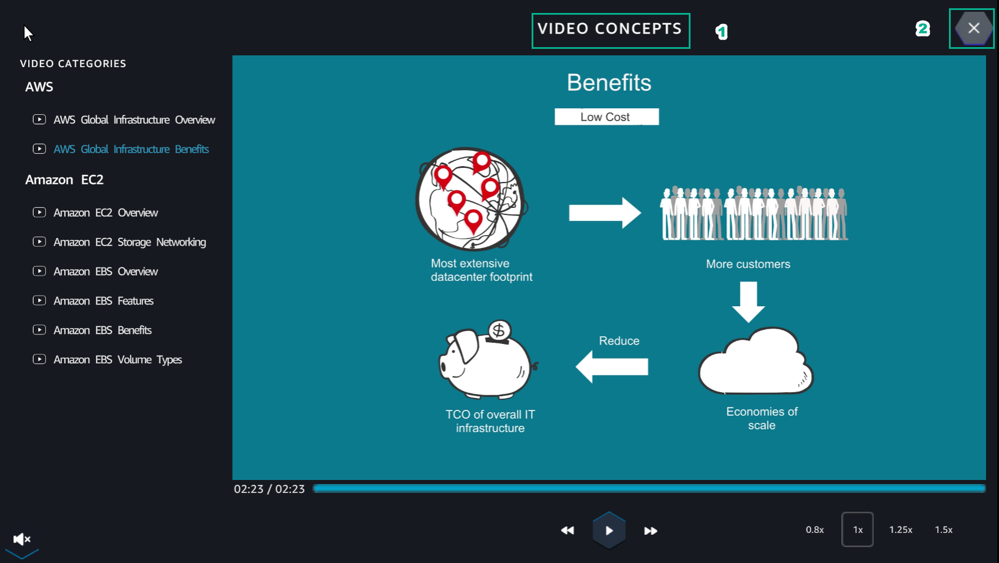
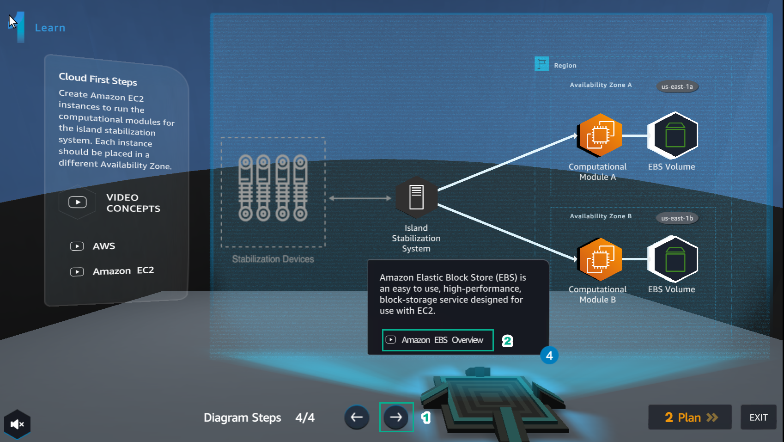
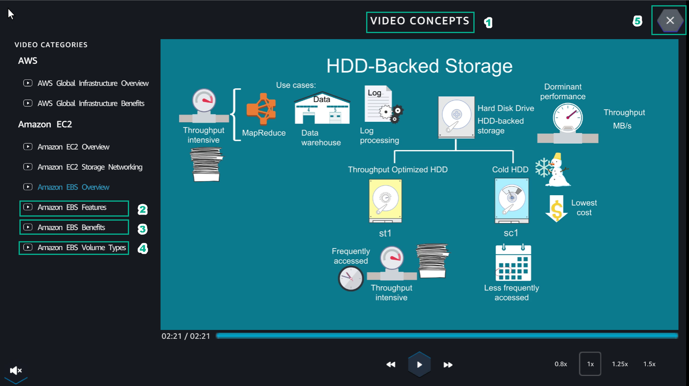

**LEARN**

1. In the **Learn** interface, select **AWS Global Infrastructure Overview**

.. image:: picture/0001-learn.png  
   :align: center  
   :width: 700px

2. Watch **VIDEO CONCEPTS**, then select **X**

3. Select the arrow to the right and select **Amazon EC2 Overview**

4. Watch **VIDEO CONCEPTS**
- After watching the video **Amazon EC2 Overview**
- Select **Amazon EC2 Storage Networking**
- After watching the video **Amazon EC2 Storage Networking**, select **X** to exit 

5. Select the right arrow and select **AWS Global Infrastructure Benefits**

6. Watch **VIDEO CONCEPTS**, then select **X**

7. Select the right arrow and select **Amazon EBS Overview**

   
8. Watch **VIDEO CONCEPTS**, then select **X**
- After watching the video **Amazon EBS Overview**, select **Amazon EBS Features**
- After watching the video **Amazon EBS Features**, select **Amazon Benefits**
- After watching the **Amazon Benefits** video, select **Amazon EBS Volume Types**
- After watching the video **Amazon EBS Volume Types**, select **X** to exit   

   
