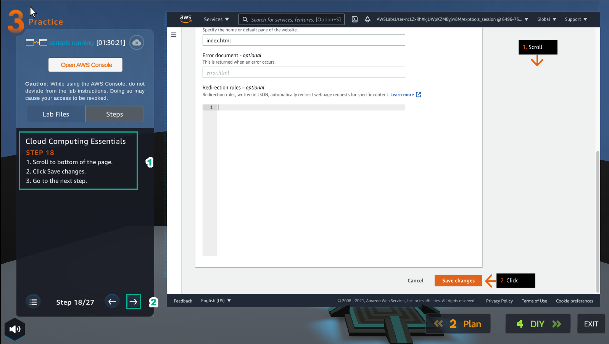
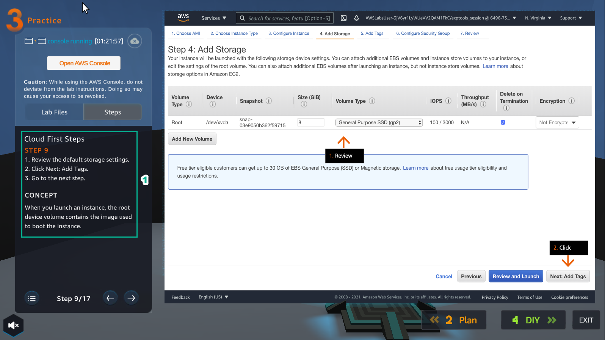
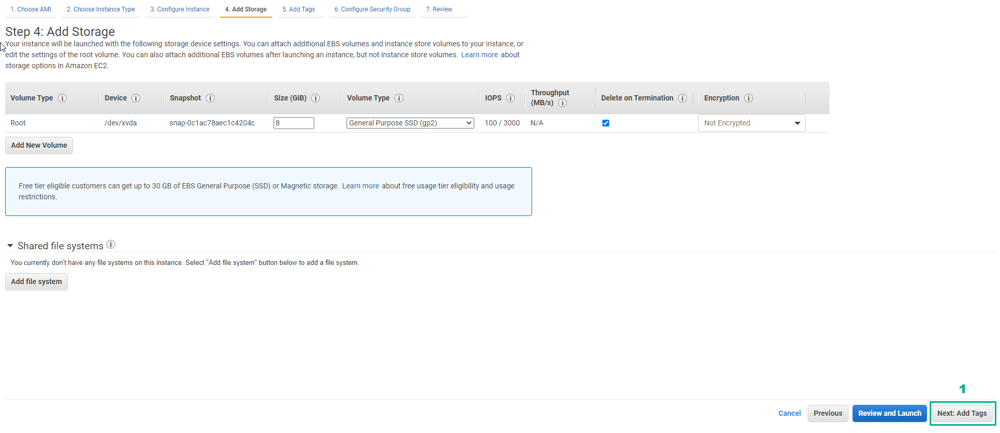

To help you explain these concepts to your classmate during your report, I’ll break each of the terms down in a simple, easy-to-understand way. You can use these explanations when you’re speaking to your classmate:

---

### **1. Program Counter (PC)**

The **Program Counter** is like a "pointer" that tells the processor where to go next to get the next instruction. Imagine you are reading a book, and the Program Counter is like the page number you're on. When the CPU finishes one instruction, it looks at the Program Counter to know where to go next.

- **How it works**: The Program Counter holds the address of the next instruction. After each instruction, it automatically moves to the next location in memory.
- **Important point**: When you first turn on the system (a power-on reset), the Program Counter is set to zero, which means the processor starts executing from the very beginning (address 0x0000) where the first instruction is.

**Key Idea**: The PC helps keep track of which instruction to run next.

---

### **2. Reset Vector**

The **Reset Vector** is like the "starting line" for the processor when it first powers on or when it gets reset. It’s a special address in memory where the first instruction is located, and it tells the processor, “This is where you start.”

- **How it works**: After a reset, the processor looks at the Reset Vector to know where to begin executing instructions.
- **Example**: In some systems (like CPU08), the reset vector is located at memory addresses **0xFFFE to 0xFFFF**.

**Key Idea**: Without the Reset Vector, the processor wouldn't know where to start after resetting.

---

### **3. Stack Pointer (SP)**

The **Stack Pointer** is a special register that keeps track of the "top" of a stack in memory. A **stack** is like a special box where data is temporarily stored while it’s needed for things like function calls or saving information.

- **How it works**: Every time the processor needs to store something in the stack, the Stack Pointer tells it where the top of the stack is.
- **PUSH operation**: Adds a value to the stack.
- **POP operation**: Retrieves a value from the stack.

**Key Idea**: The Stack Pointer helps manage data that’s temporarily needed for the system to perform tasks, like function calls.

---

### **4. Infinite Loop**

An **Infinite Loop** is a sequence of instructions that repeats forever because it doesn't have a way to stop. Imagine a never-ending cycle. In embedded systems, we use infinite loops to keep the system running and waiting for something to happen, like an interrupt or a time-based action.

- **How it works**: The system stays in the loop, waiting for an event. For example, it might stay in the loop until a user presses a button or until a timer goes off.
- **Power-saving**: Some embedded systems even "sleep" while in the infinite loop to save power.

**Key Idea**: Embedded systems often stay in an infinite loop to wait for events (like interrupts) to happen.

---

### **5. Interrupts**

An **Interrupt** is like a phone call to the processor saying, “Hey, something important just happened! You need to stop what you’re doing and handle it now.”

- **How it works**: When an interrupt occurs (either from hardware or software), it temporarily stops the current task and goes to a special piece of code called the **Interrupt Service Routine (ISR)** to handle the event.
- **Example**: If you press a button, it can trigger an interrupt telling the system to do something like turn on a light.

**Key Idea**: Interrupts make sure the processor can respond to urgent events, like a button press or a sensor reading.

---

### **6. Little Endian vs. Big Endian**

**Endian-ness** refers to how data is stored in memory, especially when dealing with multiple bytes of data. It’s about the order in which the bytes are stored.

- **Big Endian**: The most significant byte (the "big" part of the data) is stored first at the lowest memory address.
    - Example: For a number like **0x12345678**, Big Endian stores it like this:
        - Address 0x00: 0x12
        - Address 0x01: 0x34
        - Address 0x02: 0x56
        - Address 0x03: 0x78

- **Little Endian**: The least significant byte (the "little" part) is stored first.
    - Example: For the same number **0x12345678**, Little Endian stores it like this:
        - Address 0x00: 0x78
        - Address 0x01: 0x56
        - Address 0x02: 0x34
        - Address 0x03: 0x12

**Key Idea**: Different systems can store data in different orders. Little Endian is common in most modern systems, and the choice depends on the hardware architecture.

---

### Summary of Key Points:
- **Program Counter**: Tracks the next instruction the CPU needs to execute.
- **Reset Vector**: Tells the CPU where to sta**PRACTICE**

.. image:: picture/A2_Practice.png  
   :align: center  
   :width: 700px
1. Select **Practice** to perform the lab

2. Read the first step of **Cloud First Steps** and **CONCEPT**

- Select **START LAB**
- Select the arrow to the right to perform the next steps

.. image:: picture/00022-practice.png  
   :align: center  
   :width: 700px
3. Select **Open AWS Console**

- Read step 2 of **Cloud First Steps**

4. Go to **AWS Console** page

-Find EC2 service and select

.. image:: picture/00044-practice.png  
   :align: center  
   :width: 700px
5. Read step 3 of **Cloud First Steps**

-Select the arrow to the right to view and take the next step

.. image:: picture/00055-practice.png  
   :align: center  
   :width: 700px
6. Go to **AWS Console** page

-Select **EC2 Dashboard**
-Select **Launch instance**
-Continue to select *Launch instance**

.. image:: picture/00066-practice.png  
   :align: center  
   :width: 700px
7. Read step 4 of **Cloud First Steps**

.. image:: picture/00077-practice.png  
   :align: center  
   :width: 700px
8. Go to **AWS Console** page

-Select **Amazon Linux 2 AMI**

.. image:: picture/00088-practice.png  
   :align: center  
   :width: 700px
9. Read step 5 of **Cloud First Steps**

.. image:: picture/00099-practice.png  
   :align: center  
   :width: 700px
10. Go to **AWS Console** page

-Choose an **Instance Type**, select **t2.micro**
-Select **Next: Configure Instance Details**

.. image:: picture/000100-practice.png  
   :align: center  
   :width: 700px
11. Read step 6 of **Cloud First Steps**

-Select Lab Files

.. image:: picture/000110-practice.png  
   :align: center  
   :width: 700px
12. After selecting **Lab Files**, select **user-data** and download it

.. image:: picture/000120-practice.png  
   :align: center  
   :width: 700px
13. Read step 7 of **Cloud First Steps**

.. image:: picture/000130-practice.png  
   :align: center  
   :width: 700px
14. Go to **AWS Console**

-Select VPC
-Select Subnet

.. image:: picture/000140-practice.png  
   :align: center  
   :width: 700px
15. Read step 8 of **Cloud First Steps**

.. image:: picture/000150-practice.png  
   :align: center  
   :width: 700px
16.  Configure Instance Details

- Go to **Configure Instance Details**
- Scroll down to **Advanced Details**
- Under **User data**, select **As file**
- Click **Select file**, then upload the file named `user-data`
- Click **Next: Add Storage**

.. image:: picture/000160-practice.png  
   :align: center  
   :width: 700px

17. Read step 9 of *Cloud First Steps*

18. **Next: Add Tags**

19. Read step 10 of *Cloud First Steps*

.. image:: picture/000190-practice.png  
   :align: center  
   :width: 700px

20. Select Next: Configure Security Group  
   
    .. image:: picture/000200-practice.png  
       :align: center  
       :width: 700px  

21. Read step 11 of *Cloud First Steps*  

    .. image:: picture/000210-practice.png  
       :align: center  
       :width: 700px  

22. Create a security group  

    - Security group name: `Security-Group-Lab`  
    - Description: `HTTP Group Lab`  
    - Rule: select `HTTP`  
    - Select **Review and Launch**  

    .. image:: picture/000220-practice.png  
       :align: center  
       :width: 700px  

23. Read step 12 of *Cloud First Steps*  

    .. image:: picture/000230-practice.png  
       :align: center  
       :width: 700px  

24. Double check and select **Launch**  

    .. image:: picture/000240-practice.png  
       :align: center  
       :width: 700px  

25. Read step 13 of *Cloud First Steps*  

    .. image:: picture/000250-practice.png  
       :align: center  
       :width: 700px  

26. Select **Proceed without a key pair**  

    - Check **I acknowledge…**  
    - Select **Launch Instances**  

    .. image:: picture/000260-practice.png  
       :align: center  
       :width: 700px  

27. Read step 14 of *Cloud First Steps*  

    .. image:: picture/000270-practice.png  
       :align: center  
       :width: 700px  

28. Select **View Instance**  

    .. image:: picture/000280-practice.png  
       :align: center  
       :width: 700px  

29. Read step 15 of *Cloud First Steps*  

    .. image:: picture/000290-practice.png  
       :align: center  
       :width: 700px  

30. Select the Amazon EC2 instance just created  

    - Find and copy **Public(IPv4) DNS name**

    .. image:: picture/000300-practice.png  
       :align: center  
       :width: 700px  

31. Read step 16 of *Cloud First Steps*  

    .. image:: picture/000310-practice.png  
       :align: center  
       :width: 700px  

32. Paste **Public(IPv4) DNS name** into the browser and press Enter 

    - View the results

    .. image:: picture/000320-practice.png  
       :align: center  
       :width: 700px  

33. 🎉 Congratulations to the player on completing the lab!  

    .. image:: picture/000330-practice.png  
       :align: center  
       :width: 700px  

