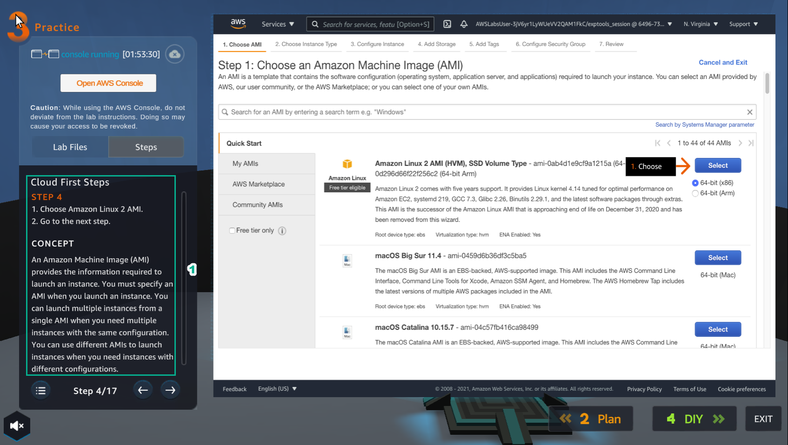

**PRACTICE**

1. Select **Practice** to perform the lab

.. image:: picture/00011-practice.png  
   :align: center  
   :width: 700px
2. Read the first step of **Cloud First Steps** and **CONCEPT**

- Select **START LAB**
- Select the arrow to the right to perform the next steps

.. image:: picture/00022-practice.png  
   :align: center  
   :width: 700px
3. Select **Open AWS Console**

- Read step 2 of **Cloud First Steps**

.. image:: picture/00033-practice.png  
   :align: center  
   :width: 700px
4. Go to **AWS Console** page

-Find EC2 service and select

.. image:: picture/00044-practice.png  
   :align: center  
   :width: 700px
5. Read step 3 of **Cloud First Steps**

-Select the arrow to the right to view and take the next step

6. Go to **AWS Console** page

-Select **EC2 Dashboard**
-Select **Launch instance**
-Continue to select *Launch instance**

7. Read step 4 of **Cloud First Steps**

8. Go to **AWS Console** page

-Select **Amazon Linux 2 AMI**

.. image:: picture/00088-practice.png  
   :align: center  
   :width: 700px
9. Read step 5 of **Cloud First Steps**

.. image:: picture/00099-practice.png  
   :align: center  
   :width: 700px
10. Go to **AWS Console** page

-Choose an **Instance Type**, select **t2.micro**
-Select **Next: Configure Instance Details**

.. image:: picture/000100-practice.png  
   :align: center  
   :width: 700px
11. Read step 6 of **Cloud First Steps**

-Select Lab Files

12. After selecting **Lab Files**, select **user-data** and download it

.. image:: picture/000120-practice.png  
   :align: center  
   :width: 700px
13. Read step 7 of **Cloud First Steps**

.. image:: picture/000130-practice.png  
   :align: center  
   :width: 700px
14. Go to **AWS Console**

-Select VPC
-Select Subnet

.. image:: picture/000140-practice.png  
   :align: center  
   :width: 700px
15. Read step 8 of **Cloud First Steps**

.. image:: picture/000150-practice.png  
   :align: center  
   :width: 700px
16.  Configure Instance Details

- Go to **Configure Instance Details**
- Scroll down to **Advanced Details**
- Under **User data**, select **As file**
- Click **Select file**, then upload the file named `user-data`
- Click **Next: Add Storage**

.. image:: picture/000160-practice.png  
   :align: center  
   :width: 700px

17. Read step 9 of *Cloud First Steps*

.. image:: picture/000170-practice.png  
   :align: center  
   :width: 700px

18. **Next: Add Tags**

.. image:: picture/000180-practice.png  
   :align: center  
   :width: 700px

19. Read step 10 of *Cloud First Steps*

.. image:: picture/000190-practice.png  
   :align: center  
   :width: 700px

20. Select Next: Configure Security Group  
   
    .. image:: picture/000200-practice.png  
       :align: center  
       :width: 700px  

21. Read step 11 of *Cloud First Steps*  

    .. image:: picture/000210-practice.png  
       :align: center  
       :width: 700px  

22. Create a security group  

    - Security group name: `Security-Group-Lab`  
    - Description: `HTTP Group Lab`  
    - Rule: select `HTTP`  
    - Select **Review and Launch**  

    .. image:: picture/000220-practice.png  
       :align: center  
       :width: 700px  

23. Read step 12 of *Cloud First Steps*  

    .. image:: picture/000230-practice.png  
       :align: center  
       :width: 700px  

24. Double check and select **Launch**  

    .. image:: picture/000240-practice.png  
       :align: center  
       :width: 700px  

25. Read step 13 of *Cloud First Steps*  

    .. image:: picture/000250-practice.png  
       :align: center  
       :width: 700px  

26. Select **Proceed without a key pair**  

    - Check **I acknowledge…**  
    - Select **Launch Instances**  

    .. image:: picture/000260-practice.png  
       :align: center  
       :width: 700px  

27. Read step 14 of *Cloud First Steps*  

    .. image:: picture/000270-practice.png  
       :align: center  
       :width: 700px  

28. Select **View Instance**  

    .. image:: picture/000280-practice.png  
       :align: center  
       :width: 700px  

29. Read step 15 of *Cloud First Steps*  

    .. image:: picture/000290-practice.png  
       :align: center  
       :width: 700px  

30. Select the Amazon EC2 instance just created  

    - Find and copy **Public(IPv4) DNS name**

    .. image:: picture/000300-practice.png  
       :align: center  
       :width: 700px  

31. Read step 16 of *Cloud First Steps*  

    .. image:: picture/000310-practice.png  
       :align: center  
       :width: 700px  

32. Paste **Public(IPv4) DNS name** into the browser and press Enter 

    - View the results

    .. image:: picture/000320-practice.png  
       :align: center  
       :width: 700px  

33. 🎉 Congratulations to the player on completing the lab!  

    .. image:: picture/000330-practice.png  
       :align: center  
       :width: 700px  

