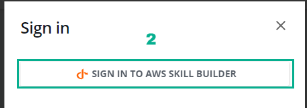

Login to Amazon account
================================
There are 4 options for logging into AWS Training and Certification:

- Login with Amazon
- AWS Partner
- Organization SSO
- Amazon Employee

.. image:: picture/amazonnotes.png  
   :align: center  
   :width: 700px 

Steps to sign in to AWS Training and Certification

1. Go to AWS Skill Builder
2. Select SIGN IN TO AWS SKILL BUILDER

3. The AWS Training and Certification login interface appears, select Login with Amazon
4. Amazon login page appears:
- Enter Email or mobile phone number
- Enter Password
- Then, select Sign-in

.. image:: picture/amazonIn.png  
   :align: center  
   :width: 700px
5. After logging in, the AWS Training and Certification interface appears.

.. image:: picture/amazonlearning.png  
   :align: center  
   :width: 700px
.. image:: picture/allowsigning.png  
   :align: center  
   :width: 700px
