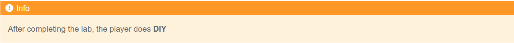
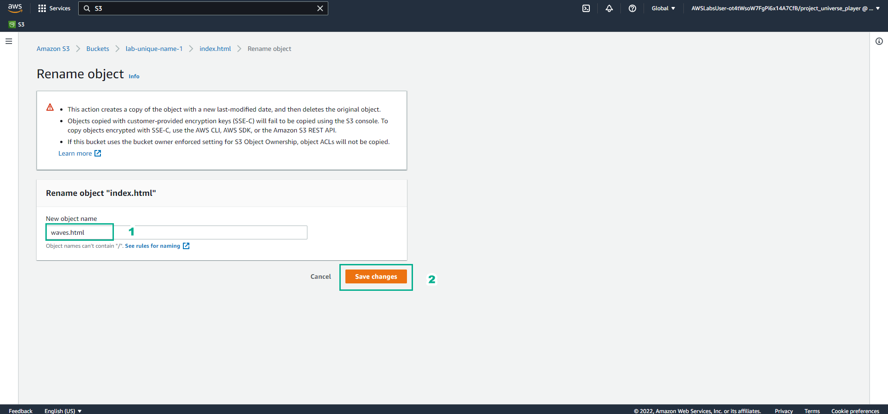
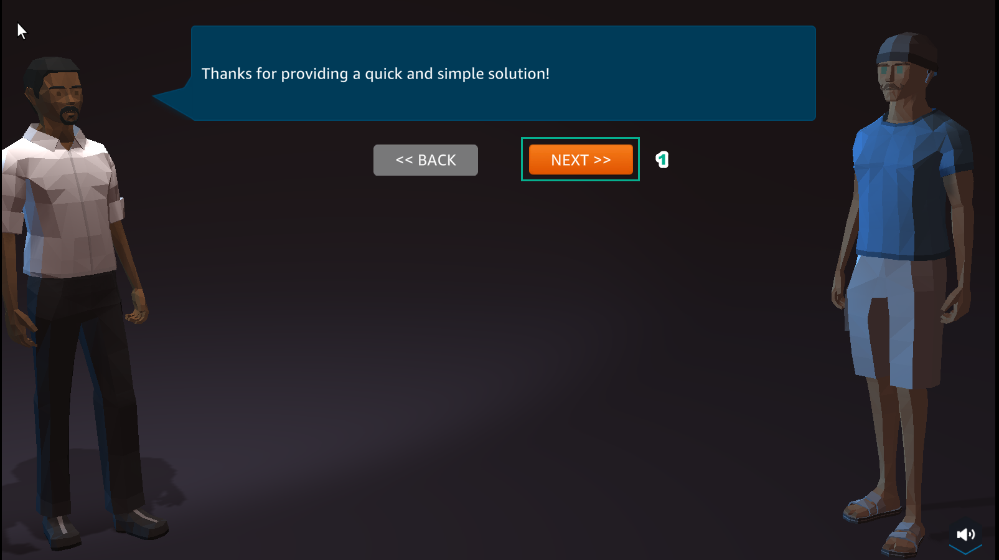

DIY
=========================================

1. In the Practice interface
- Select DIY

.. image:: picture/0001-diy.png 
   :align: center  
   :width: 700px

2. In the DIY interface
- Read DIY ACTIVITIES
- Read SOLUTION VALIDATION METHOD

.. image:: picture/0002-diy.png 
   :align: center  
   :width: 700px

3. In the AWS Console interface
- Find S3
- Select S3

4. In the Amazon S3 interface
- Select Buckets
- Select lab-unique-name-1
- Select index.html
- Select Actions
- Select Rename object

.. image:: picture/0004-diy.png 
   :align: center  
   :width: 700px

5. In the Rename object interface
- Change index.html to waves.html
- Select Save changes

6. In the Amazon S3 interface
- View the result of renaming object
- Select waves.html

.. image:: picture/0006-diy.png 
   :align: center  
   :width: 700px

7. In the wave.html interface
- Select Properties
- View Object URL
- Copy Object URL

8. In the DIY interface
- Paste Object URL into VALIDATION FORM
- Select VALIDATE

9. In the DIY interface
- After selecting VALIDATE, VALIDATION MESSAGE appears 200 OK. Succcess!…
- Select EXIT to exit

.. image:: picture/0009-diy.png 
   :align: center  
   :width: 700px

10. In the city interface
- Select ASSIGNMENTS
- Select COLLECT

.. image:: picture/00010-diy.png 
   :align: center  
   :width: 700px

11. Select NEXT

12. Select COLLECT

.. image:: picture/00012-diy.png 
   :align: center  
   :width: 700px
