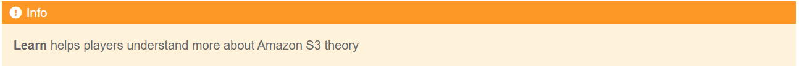

LEARN
=====================================

1. In the Learn interface

- Read step 1 of Diagram Steps
- Select Amazon S3 Overview
- Select the arrow to the right to see the next steps

.. image:: picture/0001-learn.png 
   :align: center  
   :width: 700px

2. In the VIDEO CONCEPTS interface
- Watch video Amazon S3 Overview
- Select X to exit

.. image:: picture/0002-learn.png 
   :align: center  
   :width: 700px

1. In the Learn interface
- Read step 2 of Diagram Steps
- Select Amazon S3 More Features
- Select the arrow to the right to see the next steps

.. image:: picture/0003-learn.png 
   :align: center  
   :width: 700px

4. In the VIDEO CONCEPTS interface
- Watch video Amazon S3 More Features
- Select X to exit

.. image:: picture/0004-learn.png 
   :align: center  
   :width: 700px

5. In the Learn interface
- Read step 3 of Diagram Steps
- Select Amazon S3 - Access Management
- Select the arrow to the right to see the next steps

.. image:: picture/0005-learn.png 
   :align: center  
   :width: 700px

6. In the VIDEO CONCEPTS interface
- Watch video Amazon S3 - Access Management
- Select X to exit

.. image:: picture/0006-learn.png 
   :align: center  
   :width: 700px

7. In the Learn interface
- Read step 4 of Diagram Steps
- Select Plan to go to Plan

.. image:: picture/0008-learn.png 
   :align: center  
   :width: 700px
