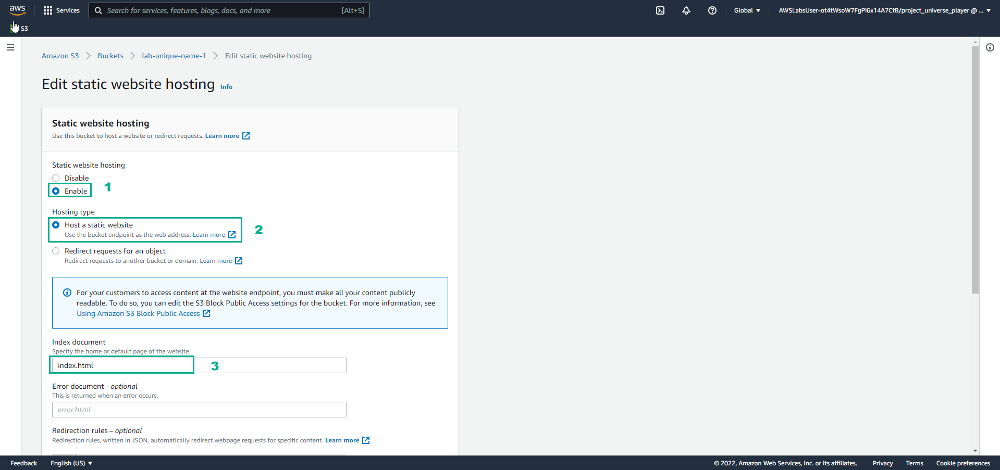
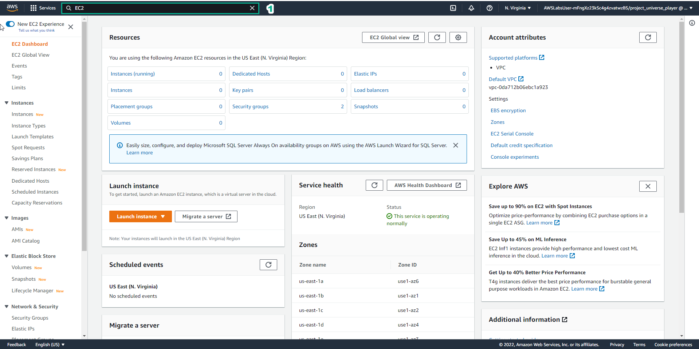

PRACTICE
==================================================

In the Practice interface
- Read step 1 of Cloud Computing Essentials
- Read CONCEPT
- Select START LAB
- Select the arrow to the right to see the next step

.. image:: picture/0001-practice.png 
   :align: center  
   :width: 700px

1.  In the Practice interface
- Read step 1 of Cloud Computing Essentials
- Read CONCEPT
- Select START LAB
- Select the arrow to the right to see the next step

.. image:: picture/0002-practice.png 
   :align: center  
   :width: 700px

2. In the Practice interface

- Read step 2 of Cloud Computing Essentials
- Select Open AWS Console

.. image:: picture/0003-practice.png 
   :align: center  
   :width: 700px

3. In the Practice interface

- Select Lab Files
- Download labcode.zip to your device
- After downloading, extracting files will be as shown

.. image:: picture/0004-practice.png 
   :align: center  
   :width: 700px

4. In the Practice interface

- Read step 3 of Cloud Copunting Essentials
- Select the arrow to the right to see the next steps

.. image:: picture/0005-practice.png 
   :align: center  
   :width: 700px

5. In the Practice* interface

- Read step 4 of Cloud Computing Essentials
- Read CONCEPT
- Select the arrow to the right to see the next steps

.. image:: picture/0006-practice.png 
   :align: center  
   :width: 700px

6. In the Amazon S3 interface
- Find S3
- Select S3

.. image:: picture/0007-practice.png 
   :align: center  
   :width: 700px

7. In the Practice interface

- Read step 5 of Cloud Computing Essentials
- Read CONCEPT
- Select the arrow to the right to see the next steps 

.. image:: picture/0008-practice.png 
   :align: center  
   :width: 700px

8. In the Amazon S3 interface

- Select Buckets
- Select Create bucket

.. image:: picture/0009-practice.png 
   :align: center  
   :width: 700px

9. In the Practice interface

- Read step 6 of Cloud Computing Essentials
- Read CONCEPT
- Select the arrow to the right to see the next steps

10. In the Create bucket interface

- Bucket name, enter lab-unique-name-1
- AWS Region, enter US East (N. Virginia) us-east-1

.. image:: picture/00011-practice.png 
   :align: center  
   :width: 700px

11.In the Practice interface

- Read step 7 of Cloud Computing Essentials
- Select the arrow to the right to see the next steps

.. image:: picture/00012-practice.png 
   :align: center  
   :width: 700px

12. In Object Ownership

- Select ACLs enabled
- Select Object writer

.. image:: picture/00013-practice.png 
   :align: center  
   :width: 700px

13. In the Practice interface

- Read step 8 of Cloud Computing Essentials
- Read CONCEPT
- Select the arrow to the right to see the next steps

.. image:: picture/00014-practice.png 
   :align: center  
   :width: 700px

14. In the Amazon S3 interface

- Uncheck Block all public access
- Select I acknowledge…

.. image:: picture/00015-practice.png 
   :align: center  
   :width: 700px

15. In the Practice interface
- Read step 9 of Cloud Computing Essentials
- Read CONCEPT
- Select the arrow to the right to see the next steps

.. image:: picture/0016-practice.png 
   :align: center  
   :width: 700px

16. In the Amazon S3 interface

- In the Default encryption section, select Enable
- Select **Amazon S3-managed keys (SSE-S3)
- Select Create bucket

.. image:: picture/00017-practice.png 
   :align: center  
   :width: 700px

17.In the Practice interface

- Read step 10 of Cloud Computing Essentials
- Read CONCEPT
- Select the arrow to the right to see the next steps

.. image:: picture/00018-practice.png 
   :align: center  
   :width: 700px

18. In the Amazon S3 interface

- Select View details

.. image:: picture/00019-practice.png 
   :align: center  
   :width: 700px

19. In the Practice interface

- Read step 11 of Cloud Computing Essentials
- Read CONCEPT
- Select the arrow to the right to see the next steps

20. In the Amaozon S3 interface

- Select Upload

.. image:: picture/00021-practice.png 
   :align: center  
   :width: 700px

21. In the Practice interface

- Read step 12 of Cloud Computing Essentials
- Select the arrow to the right to see the next steps

.. image:: picture/00022-practice.png 
   :align: center  
   :width: 700px

22. In the Amazon S3 interface

- Select Add files
- Select uploaded files extracted from labcode.zip
- Select Upload

.. image:: picture/00023-practice.png 
   :align: center  
   :width: 700px

23. In the Practice interface

- Read step 13 of Cloud Computing Essentials
- Read CONCEPT
- Select the arrow to the right to see the next steps

.. image:: picture/00024-practice.png 
   :align: center  
   :width: 700px

24. In the Amazon S3 interface

- View successfully uploaded files
- Select Close

.. image:: picture/00025-practice.png 
   :align: center  
   :width: 700px

25. In the Practice interface

- Read step 14 of Cloud Computing Essentials
- Select the arrow to the right to see the next steps

.. image:: picture/00026-practice.png 
   :align: center  
   :width: 700px

26. In the Amazon S3 interface

- Select and view files
- Select Actions
- View the Edit actions

.. image:: picture/00027-practice.png 
   :align: center  
   :width: 700px

27. In the Practice interface

- Read step 15 of Cloud Computing Essentials
- Read CONCEPT
- Select the arrow to the right to see the next steps

.. image:: picture/00028-practice.png 
   :align: center  
   :width: 700px

28. In the Amazon S3 interface

- Select Properties

.. image:: picture/00029-practice.png 
   :align: center  
   :width: 700px

29. In the Practice interface

- Read step 16 of Cloud Computing Essentials
- Bury arrow to the right to see next steps

30. In the Amazon S3 interface

- Select Edit

.. image:: picture/00031-practice.png 
   :align: center  
   :width: 700px

31. In the Practice interface

- Read step 17 of Cloud Computing Essentials
- Read CONCEPT
- Select the arrow to the right to see the next steps

32. In the interface Edit static website hosting

- Select Enable
- Select Host a static website
- In Index document, enter index.html

.. image:: picture/00033-practice.png 
   :align: center  
   :width: 700px

33. In the Practice interface

- Read step 18 of Cloud Computing Essentials
- Select the arrow to the right to see the next steps

.. image:: picture/00034-practice.png 
   :align: center  
   :width: 700px 

34. In the Amazon S3 interface

- Select Save changes
.. image:: picture/00035-practice.png 
   :align: center  
   :width: 700px

35. In the Practice interface

- Read step 19 of Cloud Computing Essentials
- Read CONCEPT
- Select the arrow to the right to see the next steps

.. image:: picture/00036-practice.png 
   :align: center  
   :width: 700px

36. In the Amazon S3 interface

- Select Permissions
- View Block all public access
- Select Edit

.. image:: picture/00037-practice.png 
   :align: center  
   :width: 700px

37. In the Practice interface

- Read step 20 of Cloud Computing Essentials
- Read CONCEPT
- Select the arrow to the right to see the next steps

38. In the Edit bucket policy interface

- Copy Bucket RNA
- Remove Policy

39. In the Practice interface

- Read step 21 of Cloud Computing Essentials
- Select the arrow to the right to see the next steps

.. image:: picture/00040-practice.png 
   :align: center  
   :width: 700px

40. In the Edit bucket policy interface

- Open the file policy.text
- Replace Bucket ARN into Resource
- Copy the contents of the file policy.txt
- Paste in Policy

41. In the Practice interface

- Read step 22 of Cloud Computing Essentials
- Select the arrow to the right to see the next steps

.. image:: picture/00042-practice.png 
   :align: center  
   :width: 700px
42. In the Amazon S3 interface

- Copy the contents of the file policy.txt

.. image:: picture/00043-practice.png 
   :align: center  
   :width: 700px

43. In the Practice interface

- Read step 23 of Cloud Computing Essentials
-Select the arrow to the right to see the next steps

44. In the Amazon S3 interface

- Select Save changes

.. image:: picture/00045-practice.png 
   :align: center  
   :width: 700px

45. In the Practice interface

- Read step 24 of Cloud Computing Essentials
- Read CONCEPT
- Select the arrow to the right to see the next steps

.. image:: picture/00046-practice.png 
   :align: center  
   :width: 700px

46. ​​In the Amazon S3 interface

- Select Properties

47. In the Practice interface

- Read step 25 of Cloud Computing Essentials
- Select the arrow to the right to see the next steps

48. In the Amazon S interface

.. image:: picture/00049-practice.png 
   :align: center  
   :width: 700px
- See Hosting type
- Copy Bucket website endpoint

49. In the Practice interface

- Read step 26 of Cloud Computing Essentials
- Select the arrow to the right to see the next steps

50. Open a browser

- Paste Bucket website endpoint into the browser
- Select Enter
- View results

51. Congratulations to the player on completing the lab

.. image:: picture/00052-practice.png 
   :align: center  
   :width: 700px
