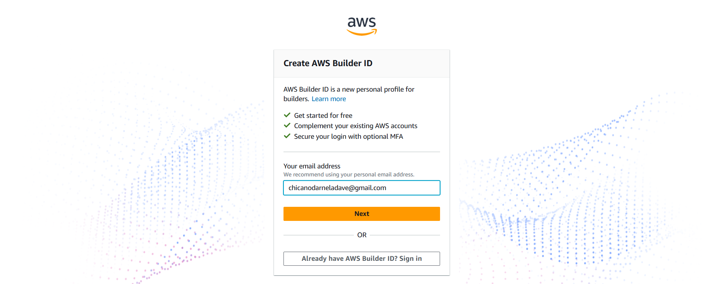

Preparation Steps!
==========================================================================

To participate in **AWS Cloud Quest: Cloud Practitioner**, we need to prepare the following:

  - **Amazon Account**
  - Create an Amazon account if you don’t have one yet.
  - Log in to [AWS Cloud Quest: Cloud Practitioner](https://aws.amazon.com/training/digital/aws-cloud-quest/) using your Amazon account.

- **System Requirements**
  - **Operating System:** 64-bit OS (Windows, macOS, or Linux)
  - **Storage:** At least 1GB of available disk space
  - **Network:** Stable broadband internet connection
  - **Graphics:** Integrated or dedicated 3D graphics
  - **Note: M1 series Mac computers may experience periodic rendering issues.**
  - **Browser:** Use the latest version of Firefox, Microsoft Edge, or Google Chrome
  - **Browsers must support HTML5, WebGL 1.0/2.0, and WASM**
  - **Note:** Mobile browsers are not supported.

Create an account on Amazon!
==========================================================================

.. image:: picture/Product.png  
   :align: center  
   :width: 700px  

- Enter User name
- Enter Mobile number and Email address to connect
- Enter Password
- Enter Re-enter password
- Next, select Verify

- New page appears, enter six-digit OTP in the space provided
- Select Create your Amazon account

**Note**
================
Before creating an Amazon account, ensure that you have a valid mobile number ready. A mobile number is required to successfully create a new account on Amazon.in, while providing an email address and location is optional.

You can sign in to your account at any time by clicking "Your Account" at the top of any Amazon page. Simply enter the same mobile number or email address and password you used during registration to access your account.
