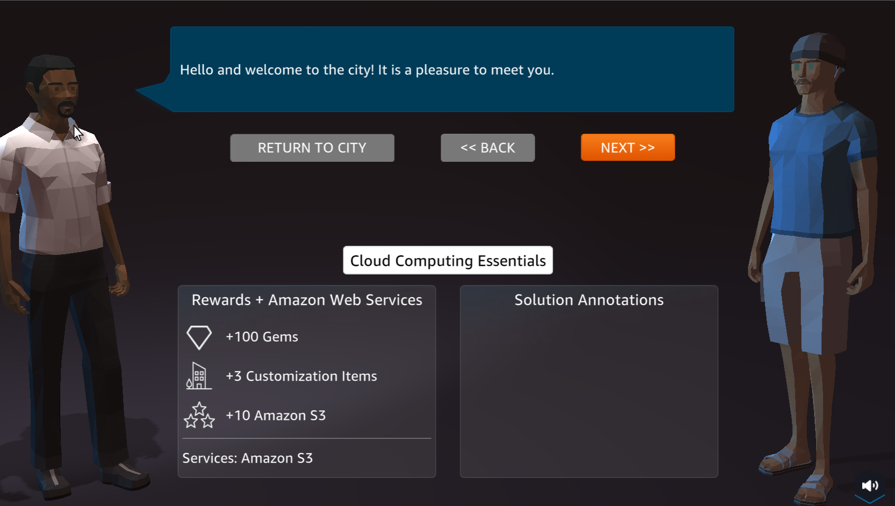

Welcome to AWS Cloud Practitioner: An Interactive Role-Playing Experience! 
==========================================================================

*Group 6*

Members:
*Kimverlie Eldo*  
*, Luwela Espinosa*  
*, Chicano Darnel Dave*  
*, Pampanga Mayvill Joy*  

**Overview**

- **AWS Cloud Quest** is the first and only role-playing game designed to help you build in-demand AWS Cloud skills through hands-on learning.

- In this interactive experience, players collect gems and earn points by solving real-world challenges and building actual cloud solutions within a live AWS environment.

Preparation Steps!
==========================================================================

To participate in **AWS Cloud Quest: Cloud Practitioner**, we need to prepare the following:

- **Amazon Account**
  - Create an Amazon account if you don’t have one yet.
  - Log in to [AWS Cloud Quest: Cloud Practitioner](https://aws.amazon.com/training/digital/aws-cloud-quest/) using your Amazon account.

- **System Requirements**
  - **Operating System:** 64-bit OS (Windows, macOS, or Linux)
  - **Storage:** At least 1GB of available disk space
  - **Network:** Stable broadband internet connection
  - **Graphics:** Integrated or dedicated 3D graphics
    - *Note: M1 series Mac computers may experience periodic rendering issues.*
  - **Browser:** Use the latest version of Firefox, Microsoft Edge, or Google Chrome
    - *Browsers must support HTML5, WebGL 1.0/2.0, and WASM*
  - **Note:** Mobile browsers are not supported.

Create an account on Amazon!
==========================================================================

.. image:: picture/Product.png  
   :align: center  
   :width: 700px  

.. image:: picture/amazonIn.png  
   :align: center  
   :width: 700px  

- Enter User name
- Enter Mobile number and Email address to connect
- Enter Password
- Enter Re-enter password
- Next, select Verify

.. image:: picture/amazonaccount.png  
   :align: center  
   :width: 700px 

- New page appears, enter six-digit OTP in the space provided
- Select Create your Amazon account

.. image:: picture/amazonvirify.png  
   :align: center  
   :width: 700px 

**Note**
================
Before creating an Amazon account, ensure that you have a valid mobile number ready. A mobile number is required to successfully create a new account on Amazon.in, while providing an email address and location is optional.

You can sign in to your account at any time by clicking "Your Account" at the top of any Amazon page. Simply enter the same mobile number or email address and password you used during registration to access your account.

Login to Amazon account
================================
There are 4 options for logging into AWS Training and Certification:

- Login with Amazon
- AWS Partner
- Organization SSO
- Amazon Employee

.. image:: picture/amazonnotes.png  
   :align: center  
   :width: 700px 

Steps to sign in to AWS Training and Certification

1. Go to AWS Skill Builder
2. Select SIGN IN TO AWS SKILL BUILDER

.. image:: picture/amazonsignIn.png  
   :align: center  
   :width: 700px

3. The AWS Training and Certification login interface appears, select Login with Amazon
4. Amazon login page appears:
- Enter Email or mobile phone number
- Enter Password
- Then, select Sign-in

.. image:: picture/amazonIn.png  
   :align: center  
   :width: 700px
5. After logging in, the AWS Training and Certification interface appears.

.. image:: picture/amazonlearning.png  
   :align: center  
   :width: 700px

Getting acquainted with AWS Cloud Quest
==============================================
**Overview**

In this step, you will register for AWS Cloud Quest and become familiar with its interface. You will also create a profile for your Cloud Citizen character.

**Content**

- https://000300.awsstudygroup.com/3-awscloudquest/"Register and check the system"
- https://000300.awsstudygroup.com/3-awscloudquest/"Build profile"

Register and test the system
===========================================
After logging in, the AWS Training and Certification interface appears with the courses.

1. Find and select AWS Cloud Quest: Cloud Practitioner
2. Continue, select ENROLL

.. image:: picture/Enrolled.png  
   :align: center  
   :width: 700px

3.  After selecting ENROLL, select START LEARNING NOW

.. image:: picture/Startlearning.png  
   :align: center  
   :width: 700px

4. Select Trailer Youtube video for an overview of AWS Cloud Quest: Cloud Practitioner

.. image:: picture/traileryoutube.png  
   :align: center  
   :width: 700px
5. After watching the video, select System Requirements to check system requirements

- OS: 64Bit operating system (Windows, macOS and Linux)
- Storage: 1GB available space
- Network: Broadband internet connection
- Graphics: Integrated or dedicated 3D graphics (Note: M1 series Mac computers may experience periodic rendering issues)
- Browser: Firefox, Microsoft Edge and Google Chrome browser (HTML 5, WebGL 1.0 or 2.0, WASM)
- Mobile browsers are not supported.

6. After checking the system, select Play AWS Cloud Quest: Cloud Practitioner
7. The interface that appears includes 12 labs ̣ (Cloud Practitioner Assignments)

- Cloud Computing Essentials
- AWS Cloud First Steps
- Computing Solutions
- Cloud Economics
- Networking Concepts
- Connecting VPCs
- Databases in Practice
- File Systems in the Cloud
- Core Security Concepts
- First NoSQL Database
- Auto-healing and Scaling applications
- Highly Available Web Applications
8. Select PLAY NOW! (wait a few minutes for the theme to load)

.. image:: picture/playnow2.png  
   :align: center  
   :width: 700px
9. AWS Cloud Quest: Cloud Practitioner interface appears, select START GAME (takes time to load the game)

.. image:: picture/startthegame.png  
   :align: center  
   :width: 700px

10. Done, the city interface has appeared.

Build profile
==============================================================================================

**After the city interface appears, we build the player profile**

1. Click on the profile picture to go to the Custom Profile page

.. image:: picture/customprofile.png  
   :align: center  
   :width: 700px

2. In Custom Profile page

3. Select EDIT/VIEW to perform player naming

- At least 3 characters
- Up to 25 characters
- Only letters and numbers
- ‘’ and '’
- No leading or trailing whitespace
4. Select ACCEPT

5. Section Body Options
- Select Body type
- Select Skin color
- Select Height
- Select Composition
- Select Shape
- Select Head size

.. image:: picture/0004-customprofile.png  
   :align: center  
   :width: 700px

6. Head Options
Select **HAIR STYLES**
Select **FACIAL HAIR**
Select **EYE COLOR**

7. The Clothing section

- Select Choose your style!
- Select TOPS
- Select BOTTOMS
- Select SHOES
- Select HATS
- Select ACCESSORIES

.. image:: picture/0006-customprofile.png  
   :align: center  
   :width: 700px

8. Select SAVE

9. Moving Guide

- Use keys A(turn left) - W(forward) - S(backward) - D(turn right)
- Choose tools as shown to experience the game
- Use Shift to skateboard
- Use mouse pointer to zoom and rotate

.. image:: picture/0007-customprofile.png  
   :align: center  
   :width: 700px

10. Using Drone Capture

A1 - Static web hosting
=======================================================================
**Overview** 

In this step we will take the first challenge in Cloud Quest.

**Content**

- Learn https://000300.awsstudygroup.com/4-staticwebhosting/4.1-learn/ 
- Plan https://000300.awsstudygroup.com/4-staticwebhosting/4.2-plan/
- Practice https://000300.awsstudygroup.com/4-staticwebhosting/4.3-practice/
- DIY https://000300.awsstudygroup.com/4-staticwebhosting/4.4-diy/

**Perform**

1. In the city interface

- Select ASSIGNMENT
- In Cloud Computing Essentials, select ROUTE AND GO

.. image:: picture/0001-webhosting.png  
   :align: center  
   :width: 700px

2. Select the ! icon to go to the next step

.. image:: picture/0002-webhosting.png  
   :align: center  
   :width: 700px

3.Select NEXT

4. In the preparation interface

- View Rewards
- See Solution Annotations
- Select ACCEPT

.. image:: picture/0004-webhosting.png  
   :align: center  
   :width: 700px

5.  Select GO TO SOLUTION CENTER

.. image:: picture/0005-webhosting.png  
   :align: center  
   :width: 700px

6. Welcome to Solution Center

.. image:: picture/0006-webhosting.png  
   :align: center  
   :width: 700px

7. Steps of Solution Center Steps

.. image:: picture/0007-webhosting.png  
   :align: center  
   :width: 700px

LEARN
=====================================

.. image:: picture/learn.png 
   :align: center  
   :width: 700px

1. In the Learn interface

- Read step 1 of Diagram Steps
- Select Amazon S3 Overview
- Select the arrow to the right to see the next steps

2. In the VIDEO CONCEPTS interface
- Watch video Amazon S3 Overview
- Select X to exit

.. image:: picture/0002-learn.png 
   :align: center  
   :width: 700px

1. In the Learn interface
- Read step 2 of Diagram Steps
- Select Amazon S3 More Features
- Select the arrow to the right to see the next steps

.. image:: picture/0003-learn.png 
   :align: center  
   :width: 700px

4. In the VIDEO CONCEPTS interface
- Watch video Amazon S3 More Features
- Select X to exit

.. image:: picture/0004-learn.png 
   :align: center  
   :width: 700px

5. In the Learn interface
- Read step 3 of Diagram Steps
- Select Amazon S3 - Access Management
- Select the arrow to the right to see the next steps

.. image:: picture/0005-learn.png 
   :align: center  
   :width: 700px

6. In the VIDEO CONCEPTS interface
- Watch video Amazon S3 - Access Management
- Select X to exit

.. image:: picture/0006-learn.png 
   :align: center  
   :width: 700px

7. In the Learn interface
- Read step 4 of Diagram Steps
- Select Plan to go to Plan

.. image:: picture/0008-learn.png 
   :align: center  
   :width: 700px

PLAN
===================================

.. image:: picture/plan.png 
   :align: center  
   :width: 700px

1. In the Plan interface
- Read Practice Lab Goals
- Read DIY Goals
- Select Practice to conduct the lab

.. image:: picture/0001-plan.png 
   :align: center  
   :width: 700px

PRACTICE
==================================================

.. image:: picture/practise.png 
   :align: center  
   :width: 700px

In the Practice interface
- Read step 1 of Cloud Computing Essentials
- Read CONCEPT
- Select START LAB
- Select the arrow to the right to see the next step

.. image:: picture/0001-practice.png 
   :align: center  
   :width: 700px

1.  In the Practice interface
- Read step 1 of Cloud Computing Essentials
- Read CONCEPT
- Select START LAB
- Select the arrow to the right to see the next step

. image:: picture/0002-practice.png 
   :align: center  
   :width: 700px

2. In the Practice interface

- Read step 2 of Cloud Computing Essentials
- Select Open AWS Console

. image:: picture/0003-practice.png 
   :align: center  
   :width: 700px

